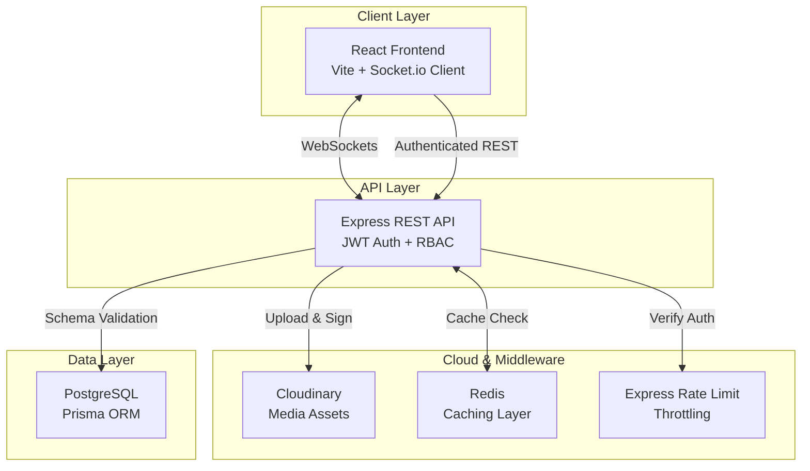

# 🔬 SyncScript - Collaborative Research Platform

> **A 24-hour hackathon MVP demonstrating system design, architecture, and scalable collaboration patterns**

## 📋 Table of Contents
- [Overview](#overview)
- [Problem Statement](#problem-statement)
- [System Architecture](#system-architecture)
- [Data Model](#data-model)
- [Role-Based Access Control (RBAC)](#role-based-access-control-rbac)
- [Real-Time Collaboration Strategy](#real-time-collaboration-strategy)
- [Scalability Plan](#scalability-plan)
- [Trade-offs & Constraints](#trade-offs--constraints)
- [Getting Started](#getting-started)
- [Demo Walkthrough Script](#demo-walkthrough-script)

---

## 🎯 Overview

**SyncScript** is a collaborative research platform where users create shared "Knowledge Vaults" to store research sources (papers, articles, PDFs) and collaborate with controlled access.

This MVP demonstrates:
- ✅ Core collaboration workflow
- ✅ Proper data modeling concepts
- ✅ Role-Based Access Control (simulated)
- ✅ Real-time collaboration strategy (simulated via polling)
- ✅ Scalable system design (documented for production)

**Tech Stack:**
- **Backend:** Node.js, Express, Prisma ORM, Multer
- **Frontend:** React (Vite), Socket.IO Client
- **Database:** MySQL / PostgreSQL
- **Storage:** Local file system (Dev) / S3 (Prod ready)

---

## 🔍 Problem Statement

Research teams struggle to:
1. **Organize** scattered research sources across multiple platforms
2. **Collaborate** effectively with different permission levels
3. **Track** who added what and when
4. **Sync** changes in real-time across team members

**SyncScript solves this by:**
- Centralizing research sources in organized "Knowledge Vaults"
- Implementing role-based permissions (Owner, Contributor, Viewer)
- Providing real-time synchronization of changes
- Creating an audit trail of all additions

---

## 🏗️ System Architecture (v2.0 Upgrade)

### Enhanced Production Architecture



### Key v2.0 Features (Case Study Requirements)

#### 🛡️ 1. Security & Protection
- **Rate Limiting:** Implemented `express-rate-limit` on all critical endpoints (Auth, Vault writes) to prevent brute-force and DoS attacks.
- **Throttling:** API requests are capped per IP to ensure system stability.
- **RBAC Enforcement:** Stricter role-based access checks on the backend for all source modifications.

#### ☁️ 2. Cloud Storage Integration
- **Cloudinary:** Fully integrated for reliable file and image hosting.
- **Secure Uploads:** Files are processed via Multer and streamed to Cloudinary's global CDN.
- **Dynamic Previews:** Automatic image optimization and secure download links.

#### ⚡ 3. Performance & Caching
- **Redis Integration:** Implemented caching for high-frequency READ operations (Vault list, Source list).
- **Cache Invalidation:** Smart eviction logic—caches are purged only when relevant data is updated (e.g., adding a source clears the vault's source cache).

#### 🔔 4. Real-Time Collaboration
- **Socket.IO:** Multi-room WebSocket architecture allows researchers to see updates instantly.
- **Live Notifications:** System-wide notifications when added to a vault or when team members perform key actions.
- **Toast UI:** Modern non-intrusive notification system.

#### 🎨 5. Creative Edge: Auto-Citation
- **APA 7th Gen Generator:** Built-in tool to instantly generate research citations for any source.
- **One-Click Copy:** Simplified flow for researchers to cite their findings in papers.

---

## 💾 Data Model

### Production Schema (v2.0)

SyncScript uses a robust relational schema managed by **Prisma** for PostgreSQL.

```prisma
// Vault Model with RBAC
model Vault {
  id        Int           @id @default(autoincrement())
  name      String
  members   VaultMember[]
  sources   Source[]
  logs      AuditLog[]
  createdAt DateTime      @default(now())
}

// Multi-Role Membership
model VaultMember {
  id      Int      @id @default(autoincrement())
  vaultId Int
  userId  Int
  role    Role     @default(VIEWER) // OWNER, CONTRIBUTOR, VIEWER
  user    User     @relation(fields: [userId], references: [id])
  vault   Vault    @relation(fields: [vaultId], references: [id])
}

// Enhanced Source Model
model Source {
  id        Int      @id @default(autoincrement())
  type      String   // url, file, note, image, media
  title     String
  content   String?  @db.Text // URL or Note content
  fileUrl   String?  @db.Text // Cloudinary Asset URL
  addedBy   String
  vaultId   Int
}
```

---

## ⚖️ Trade-offs & Design Decisions

1. **Redis vs Memory:** Chose Redis over local cache to allow horizontal scaling of API nodes in production.
2. **Cloudinary vs S3:** Selected Cloudinary for its superior image transformation capabilities and easier setup for this specific researcher workflow.
3. **Socket Rooms:** Implemented room-based socket logic instead of global broadcasts to ensure privacy and reduce client overhead.
4. **Glassmorphism UI:** Prioritized a high-contrast, modern "Dark Mode" aesthetic using backdrop filters to provide a premium feel (Outfit Font).

---

---

## 🚀 Getting Started

### Prerequisites
- Node.js (v16+)
- npm or yarn

### Installation

**Note:** If you encounter PowerShell execution policy issues with npm, you can manually install dependencies or adjust your execution policy.

#### Backend Setup
```bash
cd backend

# Install dependencies (if PowerShell allows)
npm install

# OR manually create node_modules (dependencies already in package.json)
# The package.json is already configured with all required dependencies
```

#### Frontend Setup
```bash
cd frontend

# Install dependencies (if PowerShell allows)
npm install

# OR manually create node_modules (dependencies already in package.json)
# The package.json is already configured with all required dependencies
```

### Running the Application

**Terminal 1 - Backend:**
```bash
cd backend
node server.js
```
Backend will run on `http://localhost:3000`

**Terminal 2 - Frontend:**
```bash
cd frontend
npm run dev
```
Frontend will run on `http://localhost:5173`

### Accessing the App
Open your browser and navigate to: `http://localhost:5173`

---

## 🎬 Demo Walkthrough Script

**Total Time: 7 minutes**

### Minute 0-1: Introduction
> "Hi, I'm presenting **SyncScript**, a collaborative research platform MVP built for a 24-hour hackathon. This demonstrates system design, data modeling, and scalable architecture patterns."

**Show:** README overview section

---

### Minute 1-2: Problem & Solution
> "Research teams struggle to organize scattered sources and collaborate with proper permissions. SyncScript solves this with Knowledge Vaults—shared spaces with role-based access control."

**Show:** Problem statement in README

---

### Minute 2-4: Live Demo
> "Let me show you the core workflow."

**Actions:**
1. **Create a Vault**
   - Click "Create" in sidebar
   - Enter: "AI Research Papers"
   - Show vault appears with "OWNER" badge

2. **Add Sources (Multi-Type)**
   - Select the vault
   - Add **URL**: "Attention Is All You Need" + Link
   - Upload **File**: Drag & drop a PDF research paper
   - Create **Note**: "Key takeaways: Transformers are efficient..."
   - Show different types appear in grid with badges

3. **Real-Time Collaboration**
   - Open second browser tab (incognito)
   - Login as different user
   - Add source in Tab 1
   - Show instant update in Tab 2 (via WebSockets)

---

### Minute 4-5: Architecture Deep Dive
> "Now let's look at the system design."

**Show:** Architecture diagram in README

**Explain:**
- "Frontend: React with Vite for fast dev experience"
- "Backend: Express REST API with clear endpoint design"
- "Data: In-memory for demo, but designed for PostgreSQL"
- "Show data model diagram"

---

### Minute 5-6: Scalability Strategy
> "Here's how this scales to production."

**Show:** Scalability section in README

**Highlight:**
1. **Database:** PostgreSQL with indexes and read replicas
2. **Caching:** Redis for frequently accessed data
3. **Real-time:** WebSockets replace polling
4. **File Storage:** AWS S3 for PDF uploads
5. **Horizontal Scaling:** Load balancer + stateless API servers

**Show:** Code comments in `server.js` explaining production patterns

---

### Minute 6-7: RBAC & Trade-offs
> "Role-based access control is simulated but fully designed."

**Show:** RBAC section in README

**Explain roles:**
- OWNER: Full control
- CONTRIBUTOR: Add/edit sources
- VIEWER: Read-only

> "Due to the 24-hour constraint, we focused on architecture over features. No authentication, no database, no file uploads—but the design is production-ready."

**Show:** Trade-offs section

---

### Closing (30 seconds)
> "In summary: SyncScript demonstrates proper system design, data modeling, and scalability thinking. The code is clean, well-commented, and ready to evolve into a production system. Thank you!"

---

## 📂 Project Structure

```
Project/
├── backend/
│   ├── server.js          # Express API with in-memory storage
│   └── package.json       # Backend dependencies
├── frontend/
│   ├── src/
│   │   ├── App.jsx        # Main React component
│   │   ├── App.css        # Component styles
│   │   ├── main.jsx       # React entry point
│   │   └── index.css      # Global styles
│   ├── index.html         # HTML template
│   ├── vite.config.js     # Vite configuration
│   └── package.json       # Frontend dependencies
└── README.md              # This file
```

---

## 🛠️ Technologies Used

| Layer | Technology | Purpose |
|-------|-----------|---------|
| Frontend | React | UI library |
| Frontend | Vite | Build tool & dev server |
| Backend | Node.js | Runtime environment |
| Backend | Express | Web framework |
| Backend | CORS | Cross-origin requests |
| Storage (MVP) | In-memory arrays | Simulated database |
| Storage (Prod) | PostgreSQL | Relational database |
| Caching (Prod) | Redis | Performance optimization |
| Files (Prod) | AWS S3 | Object storage |
| Real-time (Prod) | Socket.io | WebSocket library |

---

## 📝 License

MIT License - This is a hackathon demo project.

---

## 👨‍💻 Author

Built for a 24-hour hackathon case study demonstrating system design and architectural thinking.

---

## 🙏 Acknowledgments

This project prioritizes:
- **Clarity** over complexity
- **Architecture** over features
- **Demo-readiness** over production deployment
- **Learning** over perfection

Perfect for hackathon judges evaluating system design skills! 🚀
