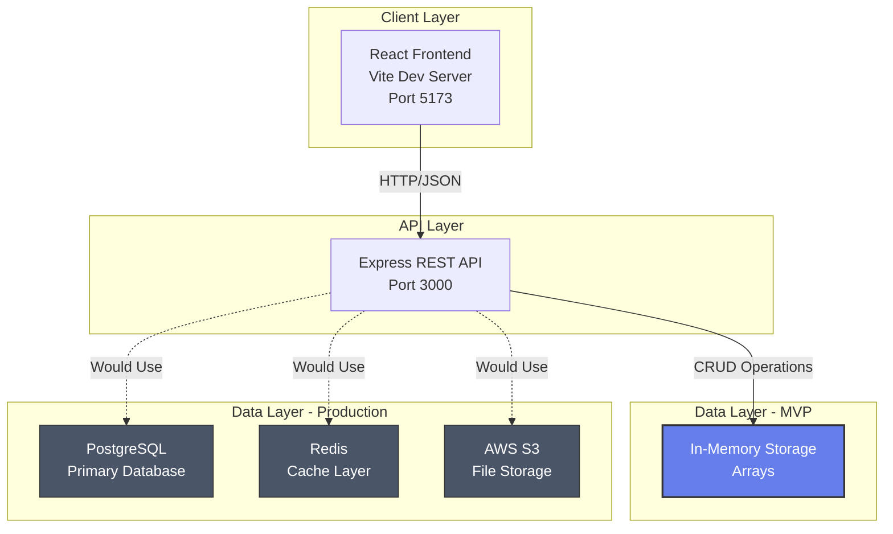
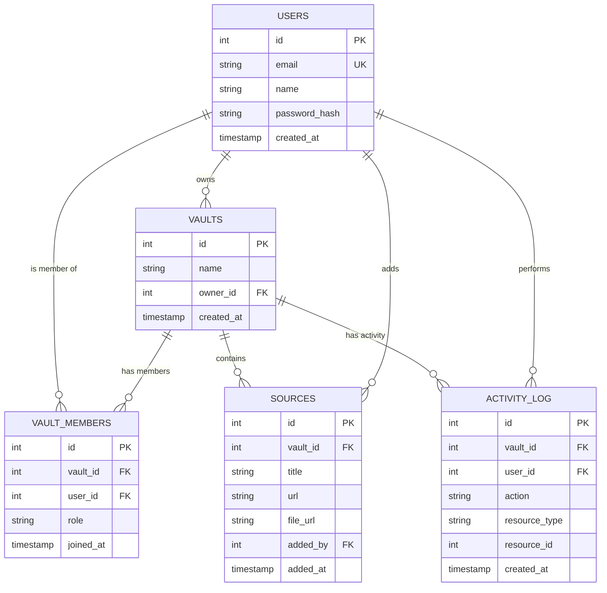
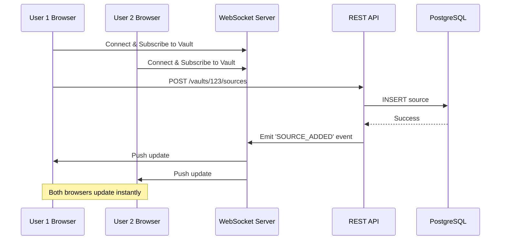

# 🔬 SyncScript - Collaborative Research Platform

> **A 24-hour hackathon MVP demonstrating system design, architecture, and scalable collaboration patterns**

## 📋 Table of Contents
- [Overview](#overview)
- [Problem Statement](#problem-statement)
- [System Architecture](#system-architecture)
- [Data Model](#data-model)
- [Role-Based Access Control (RBAC)](#role-based-access-control-rbac)
- [Real-Time Collaboration Strategy](#real-time-collaboration-strategy)
- [Scalability Plan](#scalability-plan)
- [Trade-offs & Constraints](#trade-offs--constraints)
- [Getting Started](#getting-started)
- [Demo Walkthrough Script](#demo-walkthrough-script)

---

## 🎯 Overview

**SyncScript** is a collaborative research platform where users create shared "Knowledge Vaults" to store research sources (papers, articles, PDFs) and collaborate with controlled access.

This MVP demonstrates:
- ✅ Core collaboration workflow
- ✅ Proper data modeling concepts
- ✅ Role-Based Access Control (simulated)
- ✅ Real-time collaboration strategy (simulated via polling)
- ✅ Scalable system design (documented for production)

**Tech Stack:**
- **Backend:** Node.js, Express, CORS
- **Frontend:** React (Vite), JavaScript
- **Storage:** In-memory (arrays) - simulates database

---

## 🔍 Problem Statement

Research teams struggle to:
1. **Organize** scattered research sources across multiple platforms
2. **Collaborate** effectively with different permission levels
3. **Track** who added what and when
4. **Sync** changes in real-time across team members

**SyncScript solves this by:**
- Centralizing research sources in organized "Knowledge Vaults"
- Implementing role-based permissions (Owner, Contributor, Viewer)
- Providing real-time synchronization of changes
- Creating an audit trail of all additions

---

## 🏗️ System Architecture

### High-Level Architecture



### Component Breakdown

#### Frontend (React + Vite)
- **Purpose:** User interface for vault and source management
- **Key Features:**
  - Vault creation and selection
  - Source addition and display
  - Role-based UI rendering
  - Polling for simulated real-time updates (every 3 seconds)
- **Production Enhancements:**
  - WebSocket connection for real-time updates
  - JWT authentication
  - Optimistic UI updates
  - Offline support with service workers

#### Backend (Express)
- **Purpose:** REST API for data operations
- **Endpoints:**
  - `GET /` - Health check
  - `GET /vaults` - List all vaults
  - `POST /vaults` - Create new vault
  - `GET /vaults/:id/sources` - Get vault sources
  - `POST /vaults/:id/sources` - Add source to vault
- **Production Enhancements:**
  - JWT authentication middleware
  - RBAC permission checks
  - Input validation and sanitization
  - Rate limiting
  - Error handling and logging

#### Data Storage (In-Memory → PostgreSQL)
- **MVP:** JavaScript arrays in memory
- **Production:** PostgreSQL with proper schema, indexes, and constraints

---

## 💾 Data Model

### Current (In-Memory)

```javascript
// Vault
{
  id: number,
  name: string,
  role: 'OWNER' | 'CONTRIBUTOR' | 'VIEWER',
  createdAt: ISO timestamp
}

// Source
{
  id: number,
  vaultId: number,
  title: string,
  url: string,
  addedAt: ISO timestamp
}
```

### Production (PostgreSQL Schema)

```sql
-- Users Table
CREATE TABLE users (
  id SERIAL PRIMARY KEY,
  email VARCHAR(255) UNIQUE NOT NULL,
  name VARCHAR(255) NOT NULL,
  password_hash VARCHAR(255) NOT NULL,
  created_at TIMESTAMP DEFAULT NOW()
);
CREATE INDEX idx_users_email ON users(email);

-- Vaults Table
CREATE TABLE vaults (
  id SERIAL PRIMARY KEY,
  name VARCHAR(255) NOT NULL,
  owner_id INTEGER REFERENCES users(id) ON DELETE CASCADE,
  created_at TIMESTAMP DEFAULT NOW()
);
CREATE INDEX idx_vaults_owner ON vaults(owner_id);

-- Vault Members (RBAC)
CREATE TABLE vault_members (
  id SERIAL PRIMARY KEY,
  vault_id INTEGER REFERENCES vaults(id) ON DELETE CASCADE,
  user_id INTEGER REFERENCES users(id) ON DELETE CASCADE,
  role VARCHAR(50) NOT NULL CHECK (role IN ('OWNER', 'CONTRIBUTOR', 'VIEWER')),
  joined_at TIMESTAMP DEFAULT NOW(),
  UNIQUE(vault_id, user_id)
);
CREATE INDEX idx_vault_members_vault ON vault_members(vault_id);
CREATE INDEX idx_vault_members_user ON vault_members(user_id);

-- Sources Table
CREATE TABLE sources (
  id SERIAL PRIMARY KEY,
  vault_id INTEGER REFERENCES vaults(id) ON DELETE CASCADE,
  title VARCHAR(500) NOT NULL,
  url TEXT NOT NULL,
  file_url TEXT, -- S3 URL for uploaded PDFs
  added_by INTEGER REFERENCES users(id),
  added_at TIMESTAMP DEFAULT NOW()
);
CREATE INDEX idx_sources_vault ON sources(vault_id);
CREATE INDEX idx_sources_added_by ON sources(added_by);

-- Activity Log (Audit Trail)
CREATE TABLE activity_log (
  id SERIAL PRIMARY KEY,
  vault_id INTEGER REFERENCES vaults(id) ON DELETE CASCADE,
  user_id INTEGER REFERENCES users(id),
  action VARCHAR(100) NOT NULL,
  resource_type VARCHAR(50),
  resource_id INTEGER,
  created_at TIMESTAMP DEFAULT NOW()
);
CREATE INDEX idx_activity_vault ON activity_log(vault_id);
CREATE INDEX idx_activity_user ON activity_log(user_id);
```

### Entity Relationships



---

## 🔐 Role-Based Access Control (RBAC)

### Role Hierarchy

| Role | Permissions |
|------|-------------|
| **OWNER** | Full control: add/remove members, add/edit/delete sources, delete vault |
| **CONTRIBUTOR** | Add and edit sources, view all sources |
| **VIEWER** | Read-only access to all sources |

### Implementation Strategy

#### MVP (Simulated)
- All vaults hardcoded with `role: 'OWNER'`
- UI conditionally renders buttons based on role
- No actual permission enforcement on backend

#### Production (Full RBAC)

**Authentication Middleware:**
```javascript
// Verify JWT token and attach user to request
const authenticateUser = (req, res, next) => {
  const token = req.headers.authorization?.split(' ')[1];
  if (!token) return res.status(401).json({ error: 'Unauthorized' });
  
  try {
    const decoded = jwt.verify(token, process.env.JWT_SECRET);
    req.user = decoded; // { id, email, name }
    next();
  } catch (err) {
    res.status(401).json({ error: 'Invalid token' });
  }
};
```

**Authorization Middleware:**
```javascript
// Check if user has required role for vault
const requireVaultRole = (allowedRoles) => async (req, res, next) => {
  const vaultId = req.params.id;
  const userId = req.user.id;
  
  const membership = await db.query(
    'SELECT role FROM vault_members WHERE vault_id = $1 AND user_id = $2',
    [vaultId, userId]
  );
  
  if (!membership.rows.length) {
    return res.status(403).json({ error: 'Access denied' });
  }
  
  if (!allowedRoles.includes(membership.rows[0].role)) {
    return res.status(403).json({ error: 'Insufficient permissions' });
  }
  
  req.userRole = membership.rows[0].role;
  next();
};
```

**Usage Example:**
```javascript
// Only OWNER and CONTRIBUTOR can add sources
app.post('/vaults/:id/sources', 
  authenticateUser,
  requireVaultRole(['OWNER', 'CONTRIBUTOR']),
  addSourceHandler
);
```

---

## 🔄 Real-Time Collaboration Strategy

### MVP Approach: Polling

**How it works:**
- Frontend polls API every 3 seconds
- Fetches latest vaults and sources
- Updates UI if data changed

**Code:**
```javascript
useEffect(() => {
  const pollInterval = setInterval(() => {
    fetchVaults();
    if (selectedVault) {
      fetchSources(selectedVault.id);
    }
  }, 3000);
  
  return () => clearInterval(pollInterval);
}, [selectedVault]);
```

**Pros:**
- ✅ Simple to implement
- ✅ Works with standard HTTP
- ✅ No additional infrastructure

**Cons:**
- ❌ Inefficient (constant requests even if no changes)
- ❌ Delayed updates (up to 3 seconds)
- ❌ Increased server load
- ❌ Wastes bandwidth

---

### Production Approach: WebSockets

**Architecture:**



**Implementation (Socket.io):**

**Server:**
```javascript
const io = require('socket.io')(server, {
  cors: { origin: 'http://localhost:5173' }
});

io.on('connection', (socket) => {
  // User subscribes to vault updates
  socket.on('subscribe_vault', (vaultId) => {
    socket.join(`vault_${vaultId}`);
  });
  
  socket.on('unsubscribe_vault', (vaultId) => {
    socket.leave(`vault_${vaultId}`);
  });
});

// After adding a source
io.to(`vault_${vaultId}`).emit('source_added', newSource);
```

**Client:**
```javascript
import io from 'socket.io-client';

const socket = io('http://localhost:3000');

useEffect(() => {
  if (selectedVault) {
    socket.emit('subscribe_vault', selectedVault.id);
    
    socket.on('source_added', (source) => {
      setSources(prev => [...prev, source]);
    });
    
    return () => {
      socket.emit('unsubscribe_vault', selectedVault.id);
    };
  }
}, [selectedVault]);
```

**Benefits:**
- ✅ Instant updates (no delay)
- ✅ Efficient (only sends when data changes)
- ✅ Reduced server load
- ✅ Better user experience

---

## 📈 Scalability Plan

### Current Limitations (MVP)
- In-memory storage → Data lost on restart
- Single server → No horizontal scaling
- No caching → Repeated database queries
- No file storage → Can't upload PDFs

### Production Infrastructure

#### 1. Database Layer (PostgreSQL)
**Purpose:** Persistent, relational data storage

**Optimizations:**
- **Indexes:** On foreign keys, frequently queried columns
- **Connection Pooling:** Reuse database connections (pg-pool)
- **Read Replicas:** Distribute read queries across multiple databases
- **Partitioning:** Split large tables by date or vault_id

**Example:**
```javascript
const { Pool } = require('pg');
const pool = new Pool({
  host: process.env.DB_HOST,
  database: process.env.DB_NAME,
  max: 20, // Max connections
  idleTimeoutMillis: 30000,
});
```

---

#### 2. Caching Layer (Redis)
**Purpose:** Reduce database load for frequently accessed data

**What to cache:**
- User vault lists (invalidate on vault creation)
- Vault source lists (invalidate on source addition)
- User session data

**Example:**
```javascript
const redis = require('redis');
const client = redis.createClient();

// Get vaults with caching
app.get('/vaults', async (req, res) => {
  const userId = req.user.id;
  const cacheKey = `user:${userId}:vaults`;
  
  // Try cache first
  const cached = await client.get(cacheKey);
  if (cached) {
    return res.json({ success: true, data: JSON.parse(cached) });
  }
  
  // Cache miss - query database
  const vaults = await db.query(
    'SELECT v.*, vm.role FROM vaults v JOIN vault_members vm ON v.id = vm.vault_id WHERE vm.user_id = $1',
    [userId]
  );
  
  // Store in cache (expire after 5 minutes)
  await client.setex(cacheKey, 300, JSON.stringify(vaults.rows));
  
  res.json({ success: true, data: vaults.rows });
});
```

---

#### 3. File Storage (AWS S3 / Cloudinary)
**Purpose:** Store uploaded PDF files

**Flow:**
1. User uploads PDF via frontend
2. Backend receives file, uploads to S3
3. S3 returns URL
4. Backend stores URL in database
5. Frontend displays PDF via S3 URL

**Example (AWS S3):**
```javascript
const AWS = require('aws-sdk');
const s3 = new AWS.S3();
const multer = require('multer');
const upload = multer({ storage: multer.memoryStorage() });

app.post('/vaults/:id/sources/upload', upload.single('file'), async (req, res) => {
  const file = req.file;
  const vaultId = req.params.id;
  
  // Upload to S3
  const s3Params = {
    Bucket: process.env.S3_BUCKET,
    Key: `vaults/${vaultId}/${Date.now()}_${file.originalname}`,
    Body: file.buffer,
    ContentType: file.mimetype,
  };
  
  const s3Result = await s3.upload(s3Params).promise();
  
  // Save to database
  const source = await db.query(
    'INSERT INTO sources (vault_id, title, file_url, added_by) VALUES ($1, $2, $3, $4) RETURNING *',
    [vaultId, file.originalname, s3Result.Location, req.user.id]
  );
  
  res.json({ success: true, data: source.rows[0] });
});
```

---

#### 4. Horizontal Scaling
**Load Balancer:** Distribute traffic across multiple API servers

```
                    [Load Balancer]
                    /      |      \
                   /       |       \
            [API 1]    [API 2]    [API 3]
                   \       |       /
                    \      |      /
                  [PostgreSQL Primary]
                  /                \
        [Read Replica 1]    [Read Replica 2]
```

**Stateless Design:**
- No session data stored on API servers
- JWT tokens for authentication (client-side)
- Redis for shared session data if needed

---

#### 5. CDN (CloudFlare / AWS CloudFront)
**Purpose:** Serve static assets (React build) from edge locations

**Benefits:**
- Faster load times globally
- Reduced server load
- DDoS protection

---

### Scalability Metrics

| Metric | MVP | Production Target |
|--------|-----|-------------------|
| **Concurrent Users** | ~10 | 10,000+ |
| **Request Latency** | ~50ms | <100ms (p99) |
| **Database Queries/sec** | ~100 | 10,000+ |
| **File Storage** | None | Unlimited (S3) |
| **Uptime** | N/A | 99.9% |

---

## ⚖️ Trade-offs & Constraints

### What We Built (24-hour constraint)
✅ Core collaboration flow  
✅ Clean, demo-ready UI  
✅ Proper REST API design  
✅ Comprehensive architecture documentation  
✅ Simulated RBAC and real-time sync  

### What We Skipped (Production features)
❌ User authentication (JWT, OAuth)  
❌ Database persistence (PostgreSQL)  
❌ File uploads (S3 integration)  
❌ WebSocket real-time updates  
❌ Input validation and sanitization  
❌ Error handling and logging  
❌ Unit and integration tests  
❌ Deployment configuration (Docker, CI/CD)  

### Why These Trade-offs Make Sense
This is a **system design challenge**, not a production app. The goal is to demonstrate:
1. **Architectural thinking** → Documented in comments and README
2. **Data modeling** → Proper schema design for production
3. **Scalability awareness** → Clear path from MVP to production
4. **Demo-readiness** → Functional, easy to run locally

---

## 🚀 Getting Started

### Prerequisites
- Node.js (v16+)
- npm or yarn

### Installation

**Note:** If you encounter PowerShell execution policy issues with npm, you can manually install dependencies or adjust your execution policy.

#### Backend Setup
```bash
cd backend

# Install dependencies (if PowerShell allows)
npm install

# OR manually create node_modules (dependencies already in package.json)
# The package.json is already configured with all required dependencies
```

#### Frontend Setup
```bash
cd frontend

# Install dependencies (if PowerShell allows)
npm install

# OR manually create node_modules (dependencies already in package.json)
# The package.json is already configured with all required dependencies
```

### Running the Application

**Terminal 1 - Backend:**
```bash
cd backend
node server.js
```
Backend will run on `http://localhost:3000`

**Terminal 2 - Frontend:**
```bash
cd frontend
npm run dev
```
Frontend will run on `http://localhost:5173`

### Accessing the App
Open your browser and navigate to: `http://localhost:5173`

---

## 🎬 Demo Walkthrough Script

**Total Time: 7 minutes**

### Minute 0-1: Introduction
> "Hi, I'm presenting **SyncScript**, a collaborative research platform MVP built for a 24-hour hackathon. This demonstrates system design, data modeling, and scalable architecture patterns."

**Show:** README overview section

---

### Minute 1-2: Problem & Solution
> "Research teams struggle to organize scattered sources and collaborate with proper permissions. SyncScript solves this with Knowledge Vaults—shared spaces with role-based access control."

**Show:** Problem statement in README

---

### Minute 2-4: Live Demo
> "Let me show you the core workflow."

**Actions:**
1. **Create a Vault**
   - Click "Create" in sidebar
   - Enter: "AI Research Papers"
   - Show vault appears with "OWNER" badge

2. **Add Sources**
   - Select the vault
   - Add source: "Attention Is All You Need" + URL
   - Add source: "BERT Paper" + URL
   - Show sources appear in grid

3. **Simulated Real-Time Collaboration**
   - Open second browser tab
   - Show same vault
   - Add source in Tab 1
   - Wait 3 seconds → Show it appears in Tab 2
   - Explain: "This uses polling. Production would use WebSockets for instant updates."

---

### Minute 4-5: Architecture Deep Dive
> "Now let's look at the system design."

**Show:** Architecture diagram in README

**Explain:**
- "Frontend: React with Vite for fast dev experience"
- "Backend: Express REST API with clear endpoint design"
- "Data: In-memory for demo, but designed for PostgreSQL"
- "Show data model diagram"

---

### Minute 5-6: Scalability Strategy
> "Here's how this scales to production."

**Show:** Scalability section in README

**Highlight:**
1. **Database:** PostgreSQL with indexes and read replicas
2. **Caching:** Redis for frequently accessed data
3. **Real-time:** WebSockets replace polling
4. **File Storage:** AWS S3 for PDF uploads
5. **Horizontal Scaling:** Load balancer + stateless API servers

**Show:** Code comments in `server.js` explaining production patterns

---

### Minute 6-7: RBAC & Trade-offs
> "Role-based access control is simulated but fully designed."

**Show:** RBAC section in README

**Explain roles:**
- OWNER: Full control
- CONTRIBUTOR: Add/edit sources
- VIEWER: Read-only

> "Due to the 24-hour constraint, we focused on architecture over features. No authentication, no database, no file uploads—but the design is production-ready."

**Show:** Trade-offs section

---

### Closing (30 seconds)
> "In summary: SyncScript demonstrates proper system design, data modeling, and scalability thinking. The code is clean, well-commented, and ready to evolve into a production system. Thank you!"

---

## 📂 Project Structure

```
Project/
├── backend/
│   ├── server.js          # Express API with in-memory storage
│   └── package.json       # Backend dependencies
├── frontend/
│   ├── src/
│   │   ├── App.jsx        # Main React component
│   │   ├── App.css        # Component styles
│   │   ├── main.jsx       # React entry point
│   │   └── index.css      # Global styles
│   ├── index.html         # HTML template
│   ├── vite.config.js     # Vite configuration
│   └── package.json       # Frontend dependencies
└── README.md              # This file
```

---

## 🛠️ Technologies Used

| Layer | Technology | Purpose |
|-------|-----------|---------|
| Frontend | React | UI library |
| Frontend | Vite | Build tool & dev server |
| Backend | Node.js | Runtime environment |
| Backend | Express | Web framework |
| Backend | CORS | Cross-origin requests |
| Storage (MVP) | In-memory arrays | Simulated database |
| Storage (Prod) | PostgreSQL | Relational database |
| Caching (Prod) | Redis | Performance optimization |
| Files (Prod) | AWS S3 | Object storage |
| Real-time (Prod) | Socket.io | WebSocket library |

---

## 📝 License

MIT License - This is a hackathon demo project.

---

## 👨‍💻 Author

Built for a 24-hour hackathon case study demonstrating system design and architectural thinking.

---

## 🙏 Acknowledgments

This project prioritizes:
- **Clarity** over complexity
- **Architecture** over features
- **Demo-readiness** over production deployment
- **Learning** over perfection

Perfect for hackathon judges evaluating system design skills! 🚀
